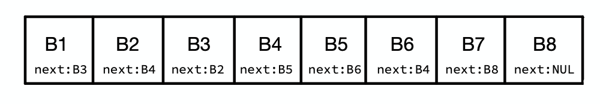

# PS05: Does it halt?

Alan is writing a program that reads data from an infinite tape. 
Each block of data in the tape contains some `data` and the `next`
block to be read. He wants to know whether his program will ever halt or not by following the chain of block references, help him solve this problem.

Given a block with the following attributes, return a boolean
indicating whether his program will ever finish or not.

```python
class Block:
  data: Any
  next: Block
```

**Note**: *next block and initial block can be `None`*.

## Examples

For the given *infinite* tape:



**Example 1:**
* Input: Block **B1**
* Output: `False`
* Explanation: After following the chain of blocks we notice that block **B4** eventually leads to block **B6** which points to block **B4** again. Sadly, Alan's program will run for eternity 😢 if he starts by reading block **B1**.

**Example 2:**
* Input: Block **B7**.
* Output: `True`
* Explanation: Block **B7** points to **B8** which in turn points to **NUL** (`None`). Therefore, there isn't a next block to be read and Alan's program will finish 🎉.

# How to submit.

* Complete the function `does_it_halt(self, block: Block) -> bool:` under `solution.py`.
* All code will be checked for readability using [**pylint**](https://www.pylint.org/).
* A grader is included, and all test cases must pass.
* ***DO NOT** modify the grader!*

# Debugging

* You can run the grader with the command `python3 grader.py < test_cases/a.txt` where `a` is the test case you want to run.
* Yo can run all test cases with the command: `for f in test_cases/*.txt; do python3 grader.py < "$f"; done`